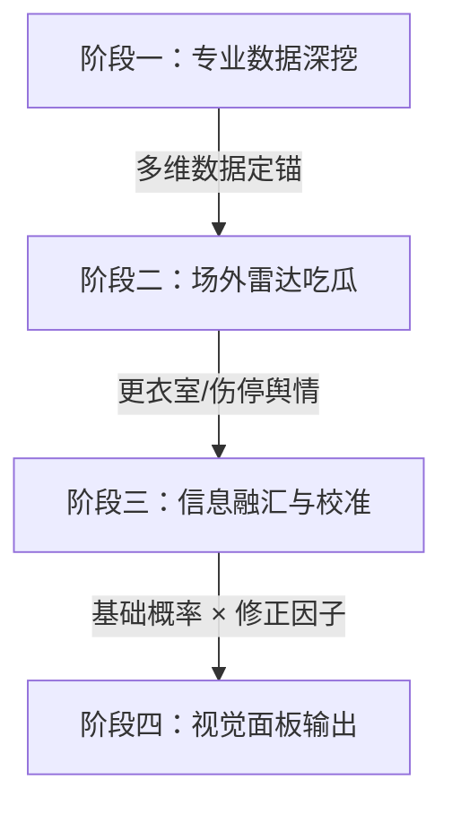

# 2026 世界杯 AI 预测与比赛实战日志 (World Cup 2026 Predictor)

这是一个用于 2026 年美加墨世界杯的 AI 预测、首发战术板以及比赛实战日志的可视化看板系统。通过美观的深色玻璃拟态（Glassmorphism）响应式 HTML 页面，展示每日比赛的实时阵容、气象环境、伤停情报及胜平负概率分析。

> [!IMPORTANT]
> **起始时间声明**：本项目的预测日志和实战记录并非从第一天开始，而是正式起步于 **2026-06-18**（即小组赛第二轮开始）。

---

## ⚽ 预测方法论

本项目的 AI 预测分析均基于以下多维度权重的综合研判：

1. **近期状态 (40%)**：预选赛战绩、本届赛事已赛表现、核心球员近况与伤病伤停。
2. **球队硬实力 (30%)**：阵容厚度、FIFA 世界排名档次、历史大赛底蕴与冠军光环。
3. **历史交锋 (15%)**：两支球队的历史对战记录与心理克制因素。
4. **情境与环境 (15%)**：东道主主场优势（美/加/墨三队）、气候气温、球场草皮类型、淘汰赛抗压经验及阵容年龄结构。

---

## 🔄 数据与舆情预测闭环 (Prediction Loop)

为了进一步榨干数据价值并排除非结构化信息的噪声，项目于 **2026-06-20** 引入了 **v2.0 增强型预测闭环流程**。该流程要求 AI 在生成每日比赛前瞻时必须严格执行四个阶段的深度分析：

### 1. 阶段一：专业数据深挖 (Deep Data Mining)
* **FotMob 深度指标**：不只看阵容本身，重点监控近 5 场球员评分走势、团队期望进球与失球（xG/xGA）、前场传切热力图、Possession won final 3rd（前场夺回球权，作为高位逼抢强度指标）以及换人效率。
* **FIFA 官方赛程与裁判环境**：查阅全场环境、球场海拔高度、气温和主裁判的执法尺度与给牌率。

### 2. 阶段二：场外雷达与舆情吃瓜 (Off-Pitch Barometer)
* **更衣室风波与内讧**：使用结构化检索指令抓取 L'Équipe、The Athletic、Marca 等媒体最新随队记者内幕，剥离隐形软实力折扣。
* **伤停真假烟雾弹**：针对赛前发布会主帅抛出的烟雾弹，实行“双一级信源印证”规则，保证战术板置灰准确度。
* **环境应激与气温**：关注极端气温雨雪天气、高海拔球场环境对体能消耗及控球打法带来的状态应激。

### 3. 阶段三：信息融汇与概率校准 (Synthesis & Calibration)
* **用数据定锚，用情报调偏**：结合阶段一的硬数据算得基础胜平负概率，然后用阶段二的舆情数据进行修正。
* **情境因子微调**：针对 ≥32°C 高温（高压逼抢队概率下调）、高海拔（非本洲球队负向修正）等进行参数级修正。
* **国别内讧体质校准**：依据历史大赛内讧数据（如法国内讧下调 15%，比利时下调 10%-12%，而荷兰/东亚球队轻微扣减），实现定量修正而非盲猜。

### 4. 阶段四：视觉面板输出 (UI Visualization)
* **更衣室晴雨表 & 舆情哨**：在每日比赛面板卡片中新增可视化图表挂件。包括**凝聚力、关键球员、外部压力、伤停风险、战术稳定性** 5 维度雷达雷区条形图，自动输出 `🟢正常出征`、`🟡注意风险`、`🔴高度警戒` 定性。

---

## 📂 项目目录结构

* `skill.md`：核心 Agent 技能文档（绿茵神算工作手册），规定了首发定位规则、AI预测面板比例和编写规范。
* `reference/`：
  * `data_sources.md`：官方赛程与实时名单参考数据源整理，供人类或 AI 开发者快速查阅。
* `index.html`：主控制台（提供各比赛日卡片入口）。
* `2026-06-18/index.html`：6月18/19日比赛日预测看板。
* `2026-06-19/index.html`：6月19/20日比赛日预测看板。
* `2026-06-20/index.html`：6月20/21日比赛日预测看板（含突尼斯换帅与远藤航伤退情报）。

---

## 🌐 在线实时渲染 (GitHub Pages)

本项目已启用 GitHub Pages。您可以通过以下网址直接访问并缩放查看实战面板：
* **主控制台**：[https://ky230.github.io/worldcup2026-predictor/](https://ky230.github.io/worldcup2026-predictor/)

*(注：在 Mac 触控板上，您可以通过双指 `Ctrl + 滚轮` 直接缩放网页至最舒适的尺寸)*
