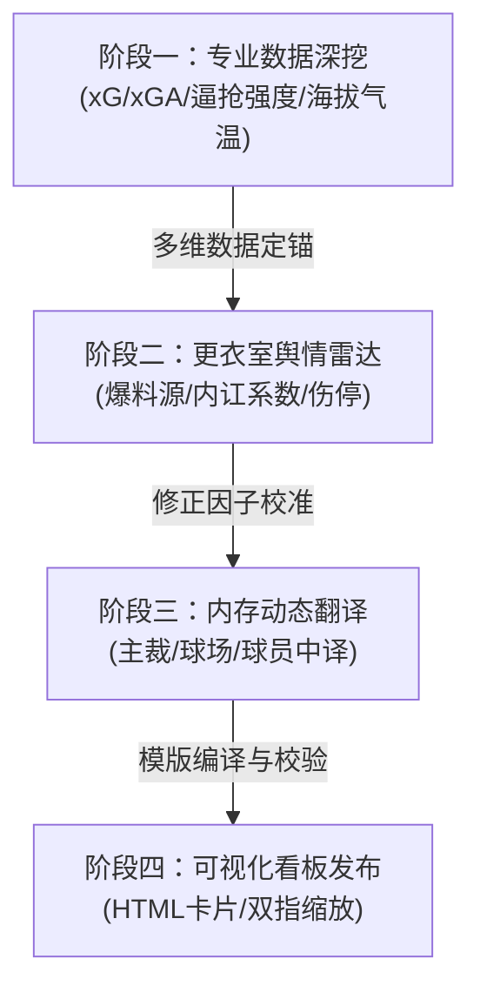
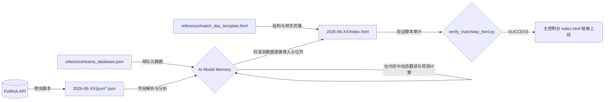

# 2026 世界杯 AI 预测与比赛实战日志 (World Cup 2026 Predictor)

这是一个用于 2026 年美加墨世界杯的 AI 预测、首发战术板以及比赛实战日志的可视化看板系统。通过美观的深色玻璃拟态（Glassmorphism）响应式 HTML 页面，展示每日比赛的实时阵容、气象环境、舆情伤停情报及胜平负概率分析。

> [!IMPORTANT]
> **起始时间声明**：本项目的预测日志和实战记录正式起步于 **2026-06-20**（即小组赛第二轮中后阶段，EF组第二轮赛事起）。所有较早期的测试历史数据及文件夹已做清理，确保预测看板聚焦于最准确的情报输入。

---

## 🔄 数据与舆情预测决策环路 (Prediction Loop)

项目引入了 **v2.0 增强型预测决策环路流程**。该流程要求 AI 在生成每日比赛前瞻时必须严格执行四个阶段的深度分析：



1. **阶段一：专业数据深挖**：解析 FotMob 期望进球 (xG)、传球成功率、前场夺回球权逼抢压力、历史战绩与主裁尺度。
2. **阶段二：场外舆情雷达**：追踪 The Athletic、队报等权威渠道更衣室情报，代入特定国别内讧打折率（如法国内讧下调 15%，比利时下调 10%-12%）微调胜率底牌。
3. **阶段三：内存动态翻译**：完全在模型内存中进行球员、主裁和球场的中文翻译与映射，拒绝硬编码映射文件以保证系统纯净度。
4. **阶段四：可视化面板输出**：根据 [match_day_template.html](file:///Users/ky230/Desktop/FF2026/reference/match_day_template.html) 编译，通过校验脚本后合并并更新主控制台。

---

## 📂 项目结构与文件依赖关系 (Dependencies & Architecture)

本项目保持极其干净的无冗余设计，取消了任何硬编码的静态翻译映射表。文件依赖和数据流关系如下：

### 1. 目录结构树

```
Repository Structure:
├── index.html                           # 主控制台 (汇总卡片与决策环路入口)
├── skill.md                             # AI Agent 技能工作手册
├── README.md                            # 项目文档与依赖说明
├── reference/
│   ├── match_day_template.html          # 空白比赛日 HTML 模版 (含更衣室晴雨表骨架)
│   ├── html_specification.md            # HTML/CSS 定位与排版规范
│   ├── data_sources.md                  # 数据抓取源链接及检索 Query 模板
│   └── teams_database.json              # [Git跟踪] 48 支球队的官方中文译名、国旗及球衣配色库
├── scripts/
│   ├── fetch_match_details.py           # 抓取 FotMob 单场首发/天气/H2H 并导出 JSON
│   ├── fetch_league_table.py            # 抓取最新小组 standings 积分榜导出 JSON
│   └── verify_matchday_html.py          # 编译质量审计脚本 (检测页面占位符/模版注释残留)
└── 2026-06-20/                          # 6月20日比赛日预测包 (样例)
    ├── index.html                       # 动态编译出的比赛日预测可视化看板
    └── json/                            # [Git忽略] 存放爬虫抓取的原始数据 JSON
        ├── standings.json               # 小组 standings 详情
        ├── netherlands_vs_sweden.json   # 荷兰 vs 瑞典 详情
        ├── germany_vs_ivory_coast.json  # 德国 vs 科特迪瓦 详情
        ├── ecuador_vs_curacao.json      # 厄瓜多尔 vs 库拉索 详情
        └── tunisia_vs_japan.json        # 突尼斯 vs 日本 详情
```

### 2. 数据流与编译依赖关系



* **爬取依赖**：运行 `fetch_match_details.py` 与 `fetch_league_table.py` 将最新数据保存至 `[date]/json/` 文件夹下。由于配置了 `.gitignore`，这些原始 JSON 数据不会提交至 Git 仓库。
* **数据映射依赖**：编译时，AI 从 [teams_database.json](file:///Users/ky230/Desktop/FF2026/reference/teams_database.json) 中匹配各国家队国旗及主客场球衣颜色，并将英文球员名、裁判名翻译为中文。
* **模版编译依赖**：克隆 [match_day_template.html](file:///Users/ky230/Desktop/FF2026/reference/match_day_template.html)，填入编译好的 HTML 块并清除底部的 Agent 专用注释。
* **审计依赖**：生成 HTML 后，必须运行 `verify_matchday_html.py` 实施自动化校验，检查是否存在占位符遗漏。

---

## 🌐 在线实时渲染 (GitHub Pages)

本项目已启用 GitHub Pages。您可以通过以下网址直接访问并缩放查看实战面板：
* **主控制台**：[https://ky230.github.io/worldcup2026-predictor/](https://ky230.github.io/worldcup2026-predictor/)

*(注：在 Mac 触控板上，您可以通过双指 `Ctrl + 滚轮` 直接缩放网页至最舒适的尺寸)*
